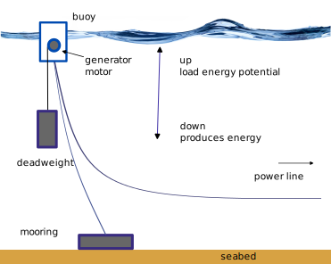

+++ 
title = "Best" 
date = "2025-06-29" 
tags = ["energia","batterie"] 
categories = ["energia"] 
banner = "img/banners/banner-2.jpg" 
+++ 

## Buoyancy Energy Storage Technology

### Una soluzione fattibile per l'accumulo dell'Energia con boe

##### Lo stoccaggio dell'energia gravitazionale è un metodo innovativo per immagazzinare energia, sfruttando la forza di gravità.

Questo approccio si distingue dalle tradizionali batterie elettrochimiche e rappresenta una soluzione potenzialmente rivoluzionaria per gestire l'intermittenza delle fonti energetiche rinnovabili, come il solare e l'eolico, che non producono energia in modo costante.

### Principio di funzionamento

Il sistema funziona in due fasi: nella fase di carica, l'energia elettrica in eccesso dalle fonti rinnovabili viene utilizzata per sollevare fino alla superficie del mare i corpi morti, che sono blocchi di materiale pesante appesi alle boe. Nella fase di scarica, quando c'è bisogno di energia, i blocchi vengono abbassati fino al fondale marino, sfruttando la gravità per produrre energia cinetica, che viene poi convertita in elettricità.

Nel nostro caso l'oggetto pesante è un corpo morto dalle dimensioni di circa 4 carrozze ferroviarie pieno di pietre appeso ad una boa delle stesse dimensioni che lo tiene sospeso.

All'interno della boa un motore elettrico solleva il corpo morto nei momenti di surplus di energia o rilascia il corpo morto diventando un generatore elettrico, nei momenti di richiesta energetica.

Il tutto viene completato da un cavo tiene ferma la boa al fondale, ed un elettrodotto marino collega la boa con il motore-generatore alla rete di distribuzione.

#### Vantaggi

I vantaggi dello stoccaggio dell'energia gravitazionale, o più specificamente dell **BEST**, rispetto ad altre fonti di energia includono:

-   **Alta efficienza**: É stata stimata da studi indipendenti un'efficienza complessiva superiore dell'80%.
-   **Basso costo** dell impianto se comparato alle alternative
-   **Zero emissioni durante l'uso:** Una volta costruite, **BEST** non emette gas a effetto serra o altri inquinanti atmosferici durante il processo di generazione di energia.
-   **Capacità di risposta rapida:** Il tempo di attivazione nell'ordine dei 250/1000 millisecondi.
-   **Accumulare energia senza perdite nel tempo**: Gli accumulatori una volta posizionati. Mantengono la loro energia senza perdite.
-   **Intraoraio, giornaliero o annuale, poliannuale**: possono sia compensare richieste di energia con cicli dai brevi che lunghi allo stesso costo e tecnologia. A tal riguardo può sostituire ad un costo minore gli stoccaggi di gas e petrolio, fornendo un vantaggio competitivo, industriale, finanziario e militare.
-   **Possibilità di utilizzare materiali riciclati**: Riempire i blocchi con inerti riciclati, contribuendo alla sostenibilità ambientale.
-   **Durata lunga:**: Gli impianti di stoccaggio gravitazionale hanno una lunga vita utile e non subiscono degradazioni significative delle capacità di accumulo nel tempo, che si misura in decenni.
-   **Integrazione ambientale**: Nei luoghi dove sono presenti gli accumulatori, le boe fisicamente inibiscono la pesca, realizzando delle aree marine protette di fatto, che permettono la riproduzione delle specie ittiche.
-   **Integrazione con allevamenti ittici**: In prossimità dei luoghi dove sono presenti gli accumulatori, posso essere realizzati facilmente degli allevamenti ittici.
-   **Indipendenza dalle condizioni climatiche**: A differenza delle fonti rinnovabili come il solare e l'eolico, che sono dipendenti dalle condizioni meteorologiche, lo stoccaggio gravitazionale non è influenzato dal clima e può fornire energia su richiesta.
-   **Integrazione con le rinnovabili**: Questa tecnologia può essere integrata con le fonti di energia rinnovabile per stabilizzare la rete elettrica e gestire l'intermittenza della produzione energetica.
-   **Basso impatto ambientale**: A differenza di alcune fonti rinnovabili che possono avere un impatto significativo sull'ambiente, come la costruzione di grandi dighe per l'energia idroelettrica, lo stoccaggio gravitazionale ha un impatto ambientale basso.
-   **Rischio ambientale basso o nullo**: A differenza di soluzioni alternative come gli stoccaggi di gas in mare, o petrolio, che posso eslodere o perdere. E anche se si rompono non provocano, inondazioni come le dighe.
-   **Riduzione della dipendenza dai combustibili fossili**: Utilizzando l'energia in eccesso da fonti rinnovabili per sollevare i pesi, lo stoccaggio gravitazionale contribuisce a ridurre la dipendenza dai combustibili fossili e a migliorare la sicurezza energetica.
-   **Militare**: lo stoccaggio, e l'infrastruttura che porta l'energia dagli accumulatori alla rete, permette di realizzare facilmente dei punti di rifornimento automatizzato sia per le unità navali convenzionali, sia per i droni marini sono di tipo subacqueo (AUV -- Autonomous Underwater Vehicle) o di superficie (USV -- Unmanned Surface Vehicle)
-   **Integrazione semplice con l'idrogeno**: Possono essere usate in combinazione di elettrolizzatori per generare al bisogno idrogeno ed ossigeno. Minimizzando i costi ed i rischi e le perdite per lo stoccaggio dell'idrogeno e dell'ossiggeno.\
-   **Posso essere spostate cariche**, in tutta sicurezza, basta che siano posizionate su di un fondale sufficentemente profondo.
-   **Non fanno rumore**.
-   Anche in mari poco profondi come il mare del nord, posso risultare utili per **compensare i picchi giornalieri**. Infatti i corpi morti si spostano di pochi centimetri al minuto e si possono usare per ore prima di arrivare al fondale marino anche nel caso di fondali bassi come nel mare del nord europa.
-   Hanno un basso, o **nullo impatto visivo**, infatti le boe al bisogno possono anche essere posizionate lievemente sotto il pelo dell'acqua, per minizzare l'impatto visivo.
-   Possono essere di **supporto ad un porto** per energizzarlo quando le navi sono in porto. Permettendo così di supportare grandi navi anche con una rete di distribuzione insufficente a supportare i picchi di richiesta creati dalle grandi navi. Il tutto senza generare l'inquinamento collegato alle grandi navi.

#### Svantaggi

-   Nei luoghi dove sono presenti gli accumulatori fisicamente **inibiscono la pesca a strascico**, e la **navigazione deve essere regolamentata** per prendere in considerazione dove sono posizionate le boe.
-   Hanno una **mobilità limitata** dalla loro massa.
-   Se spostate su di un fondale basso, perdono il loro potenziale.
-   Anche se le boe di per se' non inquinano il cavidotto che le collega alla rete influisce sulla vita degli organismi acquatici in maniera simile agli altri cavidotti sottomarini

## Tecnologie coinvolte

Generatori, motoriduttori, cantieristica navale, boe in ferro, boe in ferrocemento, elettrodotti, sono tutte tenologie che hanno superato più di 150 anni di vita ed hanno raggiunto una maturità da molti anni. Questo ci permette di avere una stima precisa dei costi, ed una previsione precisa della vita operativa della "BEST".

Esistono produttori a livello mondiale affermati e competitivi per questi componenti permettendo di realizzare una integrazione industriale veloce.

## Comparazione con le altre tecnologie di stoccaggio

### dighe idroelettriche

Lo stoccaggio di energia tramite dighe idroelettriche è una delle forme più tradizionali ed efficienti di accumulo di energia. Funziona sfruttando l'energia potenziale dell'acqua che viene sollevata ad un livello superiore rispetto alla sua posizione naturale, quindi viene rilasciata per far muovere le turbine e generare energia quando necessario.

Ecco alcuni vantaggi e sfide associate allo stoccaggio di energia tramite dighe idroelettriche:

#### Vantaggi:

-   **Capacità di risposta rapida:** Le dighe idroelettriche possono rispondere rapidamente alla domanda di energia elettrica, aumentando o riducendo la produzione in base alle esigenze del sistema elettrico.
-   **Immense capacità di stoccaggio:** Le grandi dighe idroelettriche possono immagazzinare enormi quantità di energia, fornendo una riserva affidabile per i periodi di picco della domanda o in assenza di altre fonti di energia rinnovabile intermittente.
-   **Zero emissioni durante l'uso:** Una volta costruite, le dighe idroelettriche non emettono gas a effetto serra o altri inquinanti atmosferici durante il processo di generazione di energia.
-   **Durata lunga:** Le dighe idroelettriche possono avere una vita utile molto lunga, fino a diversi decenni, con costi operativi relativamente bassi rispetto ad altre fonti di energia.

Svantaggi:

-   **Impatto ambientale:** La costruzione di grandi dighe può avere un impatto significativo sull'ecosistema locale, includendo la perdita di habitat, la migrazione delle specie ittiche e la modifica del regime idrico nei fiumi.
-   **Sfide di approvazione e pianificazione:** La pianificazione e l'approvazione di nuove dighe possono essere complesse e richiedere molto tempo a causa delle preoccupazioni ambientali, delle questioni di diritti di terra e delle implicazioni sociali.
-   **Costi di costruzione elevati:** La costruzione di nuove dighe può essere costosa e richiedere un investimento finanziario significativo, rendendo necessario un periodo di recupero dell'investimento prima che i benefici finanziari possano essere realizzati.
-   **Rischi di sicurezza:** Esistono rischi di sicurezza associati alle grandi dighe idroelettriche, inclusi il rischio di cedimenti strutturali, alluvioni improvvise o altri eventi catastrofici che potrebbero mettere in pericolo vite umane e causare danni significativi.

### Sistemi di stoccaggio di energia **ESS**

Lo stoccaggio di energia tramite batterie elettrochimiche, specialmente impianti di grande dimensione noti come sistemi di stoccaggio di energia (ESS), sta diventando sempre più popolare come soluzione per affrontare la variabilità delle fonti rinnovabili e garantire una fornitura energetica stabile e affidabile. Questi impianti utilizzano batterie al litio-ion, batterie al piombo-acido, batterie al nichel-cadmio e altre tecnologie per immagazzinare l'energia elettrica in elettricità chimica, che può essere rilasciata quando necessario.

#### Vantaggi:

-   **Flessibilità:** I sistemi di stoccaggio di energia basati su batterie sono altamente flessibili e possono essere installati in varie dimensioni e configurazioni, consentendo una risposta rapida e adattabile alla domanda di energia.
-   Rapida risposta: Le batterie possono essere attivate istantaneamente per fornire energia quando c'è un picco di domanda o una carenza di approvvigionamento da altre fonti, aiutando a mantenere la stabilità della rete elettrica.
-   Efficienza: Le moderne batterie al litio-ion e altre tecnologie di batterie possono avere un'efficienza energetica elevata, con un'alta capacità di carica e scarica ripetuta senza perdite significative di energia.
-   Modularità: Gli impianti di stoccaggio di energia basati su batterie sono modulari, il che significa che possono essere espansi o ridotti facilmente in base alle esigenze dell'utente o del sistema elettrico.

#### Svantaggi:

-   **Costi iniziali elevati:** Anche se i costi delle batterie al litio-ion sono diminuiti significativamente negli ultimi anni, l'installazione di sistemi di stoccaggio di energia su larga scala può richiedere un investimento iniziale considerevole.
-   **Durata limitata:** Anche se le moderne batterie al litio-ion hanno una durata utile più lunga rispetto alle loro controparti più vecchie, esse continuano a degradarsi nel tempo, il che può ridurre la loro capacità di immagazzinamento dell'energia nel corso degli anni.
-   **Problemi ambientali:** La produzione e lo smaltimento delle batterie possono comportare impatti ambientali significativi, inclusi il consumo di risorse naturali, l'inquinamento chimico e la gestione dei rifiuti.
-   **Rischio di incendio:** Esiste un rischio di incendio associato alle batterie al litio-ion, specialmente se non vengono gestite correttamente o se vengono sottoposte a condizioni operative estreme.

### Idrogeno

Lo stoccaggio di energia con l'idrogeno è una tecnologia promettente che viene considerata come una soluzione per affrontare i problemi legati alla disponibilità intermittente delle fonti energetiche rinnovabili, come il sole e il vento. Il processo coinvolge l'elettrolisi dell'acqua per separare l'idrogeno dall'ossigeno utilizzando energia elettrica, generalmente da fonti rinnovabili, per produrre idrogeno. Successivamente, l'idrogeno viene immagazzinato per poi essere utilizzato in futuro per generare energia attraverso celle a combustibile o tramite combustione diretta.

Ci sono diversi vantaggi e sfide associate allo stoccaggio di energia con l'idrogeno:

#### Vantaggi:

-   **Versatilità:** L'idrogeno può essere utilizzato in una varietà di settori, inclusi il trasporto, la produzione industriale e il riscaldamento residenziale, offrendo una soluzione versatile per la gestione dell'energia.
-   **Emissioni zero durante l'uso:** Quando l'idrogeno viene bruciato o utilizzato in celle a combustibile, il suo unico sottoprodotto è l'acqua, rendendolo una fonte energetica a zero emissioni durante l'uso. Stoccaggio a lungo termine: L'idrogeno può essere immagazzinato per lunghi periodi, offrendo una soluzione per il bilanciamento dell'energia tra periodi di alta produzione e bassa domanda.
-   **Riduzione della dipendenza da combustibili fossili:** Utilizzando l'idrogeno come vettore energetico, si riduce la dipendenza dai combustibili fossili e si promuove una maggiore sostenibilità ambientale.

#### Svantaggi :

-   **Efficienza energetica:** Il processo di produzione, stoccaggio e utilizzo dell'idrogeno può comportare perdite di energia, riducendo l'efficienza complessiva del sistema.
-   **Costi elevati:** Attualmente, il costo dell'idrogeno prodotto tramite elettrolisi è ancora relativamente elevato rispetto ad altre fonti energetiche, limitando la sua adozione su larga scala. Infrastrutture: È necessaria un'infrastruttura adeguata per la produzione, lo stoccaggio, il trasporto e l'utilizzo dell'idrogeno, che richiede investimenti significativi.
-   **Sicurezza:** L'idrogeno è altamente infiammabile e richiede misure di sicurezza rigorose durante la produzione, il trasporto e l'uso per prevenire incidenti.
